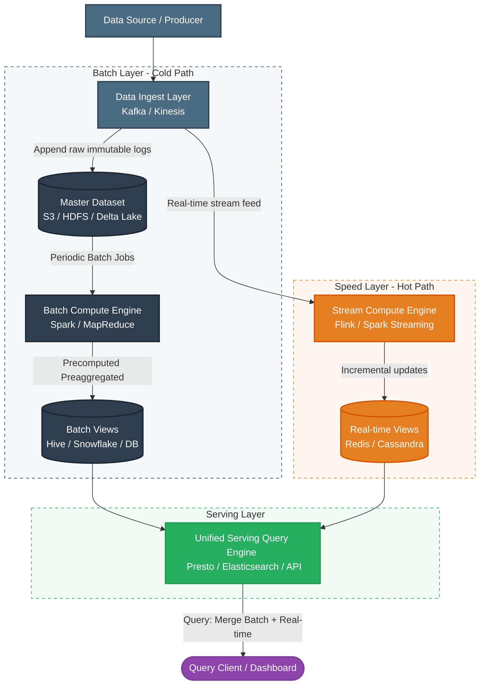
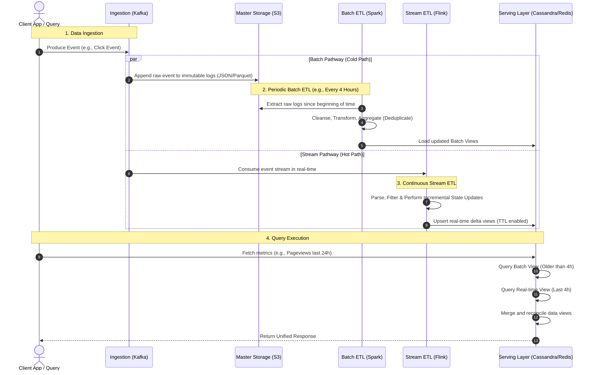

# Lambda Data ETL Architecture

The **Lambda Architecture** is a data-processing architecture designed to handle massive quantities of data by taking advantage of both batch and stream-processing methods. It provides a hybrid approach that balances low-latency updates (real-time stream processing) with comprehensive, highly accurate, and fault-tolerant historical analysis (batch processing).

This document details the architecture, its components, data flow pipelines, ETL processes, and trade-offs.

---

## 1. High-Level System Architecture

The core tenet of the Lambda Architecture is that any query can be expressed as a function over the entire history of data. 

$$\text{Query} = \text{QueryFunction}(\text{All Data})$$

To make this query function performant at petabyte scale, the Lambda Architecture splits the data processing into three distinct layers: the **Batch Layer**, the **Speed Layer**, and the **Serving Layer**.

---

## 2. Core Architectural Components

### A. Data Ingestion Layer
Data ingestion is the gateway for all raw events. It must capture incoming data and broadcast it to both the Batch and Speed layers simultaneously.
*   **Purpose**: Act as a highly durable, distributed message log buffer.
*   **Common Tech**: Apache Kafka, AWS Kinesis Streams, Google Cloud Pub/Sub.

---

### B. Batch Layer (The "Cold Path")
The Batch Layer is responsible for maintaining the definitive source of truth (the Master Dataset) and precomputing views over that dataset.
1.  **Master Dataset**: An immutable, append-only store of all historical raw data. Once written, data is never updated or deleted (except for regulatory compliance like GDPR).
2.  **Precomputed Batch Views**: Re-computed periodically (e.g., hourly or daily). The batch jobs transform the raw logs into optimized formats for querying.

*   **Pros**: Highly accurate, consistent, and resistant to human programming errors (since you can correct bugs by fixing code and re-running the batch job over the master dataset).
*   **Cons**: High latency. Computing views over petabytes of data takes hours.
*   **Common Tech**: Hadoop HDFS, AWS S3, Apache Spark, Delta Lake.

---

### C. Speed Layer (The "Hot Path")
The Speed Layer processes new data that has arrived since the last run of the Batch Layer.
*   **Purpose**: Fill the latency gap left by the Batch Layer by processing incoming events in real time.
*   **Operation**: Unlike the batch layer which does full computations, the speed layer computes **incremental** updates. For example, instead of recalculating total pageviews from scratch, it increments the count from the last batch view using the new stream events.
*   **Pros**: Low latency (milliseconds to seconds).
*   **Cons**: Approximations are sometimes required. State management is complex, and it is less accurate than the batch layer due to out-of-order events or network issues.
*   **Common Tech**: Apache Flink, Apache Spark Streaming, Apache Storm.

---

### D. Serving Layer
The Serving Layer hosts both the precomputed batch views and the real-time views, enabling them to be queried in tandem.
*   **Query Merging**: When a client requests data, the serving layer queries the **Batch View** (highly accurate, older data) and the **Real-time View** (less accurate, newest data) and merges them to provide a complete answer.
*   **Common Tech**: Apache Cassandra, Redis, Elasticsearch, Amazon DynamoDB.

---

## 3. Data Flow & ETL Pipeline Sequence

The sequence diagram below highlights how data enters the system, splits down the two paths, and is finally queried by a client.

---

## 4. Detailed ETL Process in Lambda Architecture

### The Batch ETL Flow
1.  **Extract**: Read raw, semi-structured events (JSON/CSV) from immutable object storage (S3/HDFS).
2.  **Transform**:
    *   Validate schema.
    *   Deduplicate records (critical for ensuring "exactly-once" semantics).
    *   Enrich data using master reference datasets (e.g., mapping IP addresses to locations).
    *   Convert files to optimized columnar formats like **Apache Parquet** or **ORC** partitioned by date/hour.
3.  **Load**: Write output to the batch database in the Serving Layer.

### The Speed ETL Flow
1.  **Consume**: Continuously pull events from a distributed commit log partition.
2.  **Transform**:
    *   Cleanse/parse events on the fly.
    *   Apply sliding or tumbling time windows (e.g., 5-minute event-time windows).
    *   Maintain state in-memory (backed by checkpointing, e.g., RocksDB state backend in Flink).
3.  **Load**: Write incremental updates directly to low-latency key-value stores (e.g., Redis `INCRBY` or Cassandra updates).

---

## 5. Architectural Comparison: Lambda vs. Kappa

To understand Lambda's design decisions, it is helpful to compare it to the **Kappa Architecture**, which was proposed to address some of Lambda's complexity.

| Feature | Lambda Architecture | Kappa Architecture |
| :--- | :--- | :--- |
| **Data Paths** | Two paths (Batch + Speed) | Single path (Stream-only) |
| **Codebase** | Dual codebases (e.g., Spark Batch + Flink Stream) | Single codebase (e.g., Flink/Kafka Streams only) |
| **Complexity** | High (must synchronize logic across two frameworks) | Medium (handling all aggregation, deduplication in streams) |
| **Reprocessing** | Easy: Run the batch job over historical raw files | Replay log stream from historical offsets (requires high log retention) |
| **Accuracy** | Guaranteed eventually consistent and 100% accurate | Eventually consistent; complex handling of out-of-order events |

---

## 6. Key Advantages & Trade-Offs

### Advantages
*   **Fault Tolerance**: If the speed layer fails or corrupts data due to a bug, the batch layer will overwrite it during the next run. Historical data is safe because it is immutable.
*   **Ad-Hoc Queries**: The master dataset preserves raw data, allowing you to run new analysis query scripts retroactively.
*   **Scale**: Compute tasks are distributed across cheap commodity hardware.

### Challenges (Why it can be difficult)
*   **Double-Coding**: Developers must write the same business logic twice: once for Spark (Batch) and once for Flink/Storm (Speed). *Modern libraries like Apache Beam attempt to solve this by providing a unified model.*
*   **Data Reconciliation**: Merging real-time views and batch views in the serving layer can be complex if schemas do not align perfectly.
*   **Operational Overhead**: Maintaining two separate clusters, databases, and pipelines requires substantial engineering resources.
