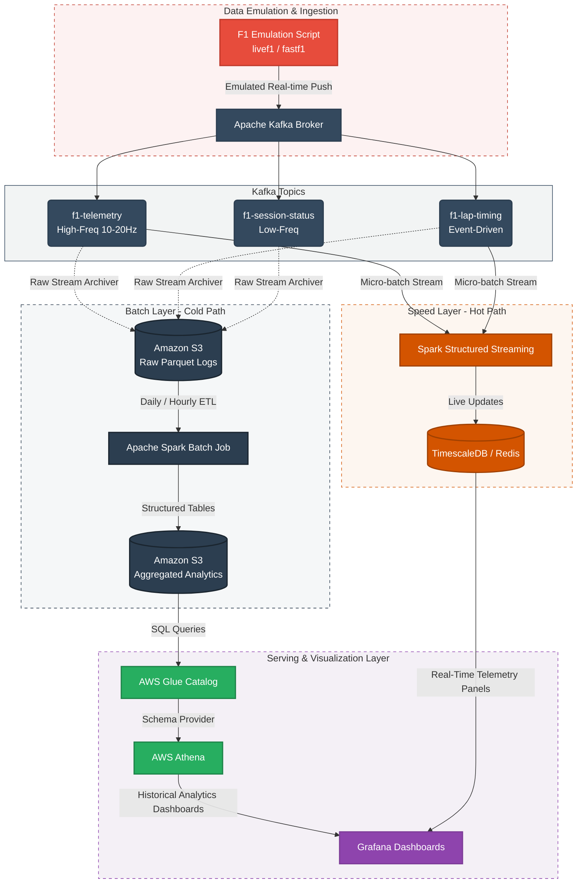
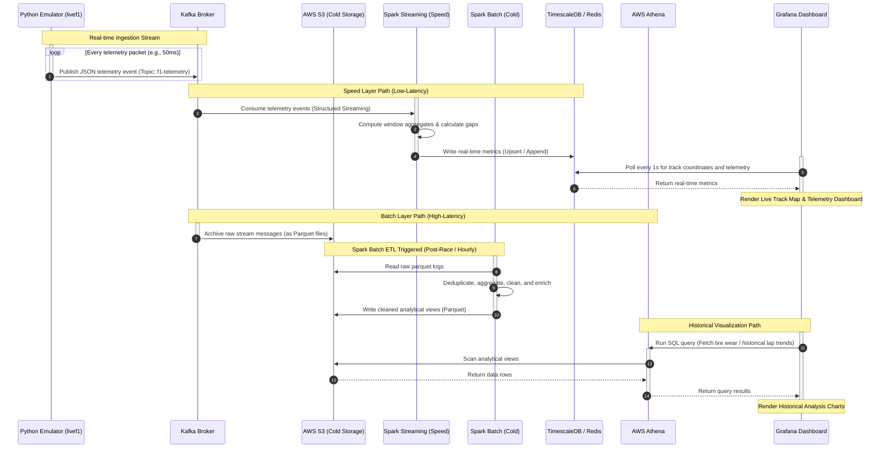

# F1 Telemetry Replay & Real-Time Analytics: Project Architecture Canvas

This document outlines the end-to-end architecture for emulating, ingestion, processing, and visualizing Formula 1 historical race telemetry as a live event using a **Lambda Architecture** pattern.

---

## 1. Project Overview & Objectives

The goal of this project is to build a real-time data streaming pipeline that replays historical Formula 1 race data (telemetry, lap times, positions, and track status) to simulate a live race environment. 

### Key Objectives:
1.  **Race Emulation**: Read historical race telemetry using the Python `livef1` (or `fastf1`) package and publish it to an ingestion buffer at actual session-time intervals.
2.  **Scalable Ingestion**: Use Apache Kafka to buffer high-frequency car telemetry (speed, throttle, brake, gear, RPM, DRS, GPS coordinates) and event-driven lap timing messages.
3.  **Dual-Path Processing (Lambda Architecture)**:
    *   **Cold Path (Batch Layer)**: Store all raw historical data in AWS S3 and execute Spark batch jobs for deep analytical queries (e.g., tyre degradation models, driver pace comparisons).
    *   **Hot Path (Speed Layer)**: Execute Spark Structured Streaming queries on Kafka streams to calculate rolling averages, live position changes, and head-to-head gaps with low latency.
4.  **Interactive Visualization**: Create real-time dashboards in Grafana to show live telemetry, and use AWS Athena for SQL queries on cold storage.

---

## 2. End-to-End System Architecture

Below is the conceptual architecture of the streaming system:



---

## 3. Data Pipeline Breakdown

### Phase A: Historical Race Emulation (Producer)
F1 race data from past events is downloaded using the `livef1` or `fastf1` client. To emulate a live race:
1.  **Time Parsing**: The Python script parses the `SessionTime` or `Date` headers of each telemetry record.
2.  **Delay Loop**: It calculates the difference in timestamps between consecutive data points. The script sleeps for that duration (or scales it, e.g., $2\times$ speed replay) before emitting the record to the Kafka broker.
3.  **Payload Structuring**: Data is converted into JSON payloads containing:
    *   `SessionID`: Unique identifier for the race (e.g., `Monza-2025-Race`).
    *   `Timestamp`: Current simulated race timestamp.
    *   `CarNumber` & `DriverCode`: E.g., `44` / `HAM`.
    *   `Metrics`: Dictionary containing `Speed`, `RPM`, `Gear`, `Throttle`, `Brake`, `DRS`, and spatial spatial GPS positions (`X`, `Y`, `Z`).

---

### Phase B: Ingestion (Apache Kafka Topic Scheme)
To handle the varying frequencies and formats of data, we deploy three main topics:
*   **`f1-telemetry`**: 
    *   *Frequency*: ~10-20 Hz per car.
    *   *Content*: Instantaneous engine telemetry and spatial coordinate updates.
    *   *Partition Key*: `DriverCode` (to ensure telemetry for each driver lands on the same partition, preserving sequence order).
*   **`f1-lap-timing`**: 
    *   *Frequency*: Event-driven (~once per driver per minute).
    *   *Content*: Lap number, Sector 1/2/3 split times, Pitstop status, tyres compound.
*   **`f1-session-status`**:
    *   *Frequency*: Infrequent (e.g., weather updates, track flags, yellow/red/green states).

---

### Phase C: Apache Spark Processing

#### 1. Speed Layer (Real-Time Spark Structured Streaming)
Spark Structured Streaming consumes from `f1-telemetry` and `f1-lap-timing` simultaneously to output real-time updates.
*   **Window Aggregations**: Computes rolling 10-second averages for driver telemetry parameters (e.g., average speeds, maximum top speed in speed traps).
*   **Gap Calculations**: Joins stream events by `SessionTime` using watermarking to calculate physical distances and delta time gaps between drivers on the track map.
*   **Storage Output**: Writes micro-batch records downstream to a time-series optimized storage backend (such as **TimescaleDB** or an in-memory database like **Redis**). This provides sub-second queries for Grafana.

#### 2. Batch Layer (Cold Path Spark ETL)
A separate Spark streaming job runs continuously (or in micro-batches with `Trigger.Once` / `Trigger.AvailableNow`) to archive all incoming Kafka topics.
*   **Raw S3 Storage**: Writes raw data to Amazon S3 in parquet files, partitioned by `SessionID`, `Topic`, and `Hour`.
*   **Batch ETL Job**: Periodically (e.g., post-session or hourly), a Spark batch job processes the raw parquet files:
    *   Removes duplicate events.
    *   Normalizes out-of-order records due to network latency.
    *   Performs complex aggregations like calculating the average tire lifespan degradation gradient across different tire compounds (soft, medium, hard).
    *   Saves the resulting clean metrics tables back into S3 (Aggregated Analytics bucket).

---

## 4. Serving & Visualization Architecture

### A. AWS Athena & Glue (Historical Querying)
*   **Glue Data Catalog**: Scans the aggregated S3 folder structure and creates table definitions (schemas) automatically.
*   **Athena**: Serves as a serverless query engine. Developers can write standard SQL queries directly over the S3 parquet data to perform post-race reviews:
    *   *Example*: Querying the throttle/brake map data for a specific corner across all laps for comparison.
```sql
SELECT driver_code, lap_number, AVG(throttle), AVG(brake) 
FROM f1_processed.telemetry 
WHERE session_id = 'Monza-2025' AND corner_id = 4
GROUP BY driver_code, lap_number;
```

### B. Grafana (Live Visualization Dashboard)
Grafana connects to both systems to display comprehensive telemetry metrics:
1.  **TimescaleDB/Redis Data Source**:
    *   **Live Track Map**: A scatter plot of $X$ and $Y$ coordinates showing car locations updating live.
    *   **Live Telemetry Overlay**: Comparison line charts comparing RPM, speed, and gear profiles for selected drivers (e.g., Driver A vs. Driver B head-to-head).
    *   **Live Gaps**: Bar charts showing intervals between cars.
2.  **AWS Athena Data Source**:
    *   **Race History Panel**: Dropdown menus to select historical race sessions.
    *   **Lap Time Analysis**: Box plots showing historical lap time consistency per driver.
    *   **Tire Degradation Curves**: Line charts mapping lap times against tire age in laps.

---

## 5. Sequence Diagram: Data Pipeline Lifecycle

This sequence diagram outlines the end-to-end data lifecycle of the F1 Telemetry Replay:



---

## 6. Implementation Action Plan (Step-by-Step)

### Step 1: Ingestion Setup
*   Configure a local Kafka Broker (Docker Compose is recommended).
*   Create topics: `f1-telemetry`, `f1-lap-timing`, and `f1-session-status` with multiple partitions (e.g., 3 partitions per topic).

### Step 2: Emulation Development
*   Install `livef1` or `fastf1` library.
*   Write a Python producer script to load a past Grand Prix (e.g., Silverstone 2024).
*   Implement event-time throttling to stream JSON messages into Kafka sequentially.

### Step 3: Speed Layer Streaming
*   Write a Spark Structured Streaming application in PySpark.
*   Parse Kafka JSON payloads into strongly typed schemas using `from_json`.
*   Establish stateful watermarking to handle lagging events.
*   Connect the stream write handler to TimescaleDB or PostgreSQL using the JDBC connector.

### Step 4: Batch Archival & Athena setup
*   Write raw stream data from Kafka straight into partitioned folders in S3.
*   Deploy AWS Glue crawler to index the directories.
*   Write SQL queries in Athena to sanity check data structures.

### Step 5: Visualization Dashboard
*   Install Grafana.
*   Set up data sources for PostgreSQL/TimescaleDB (real-time stream) and AWS Athena (historical analytics).
*   Design a unified dashboard containing a live track map, live driver telemetry, and historical race comparison graphs.
